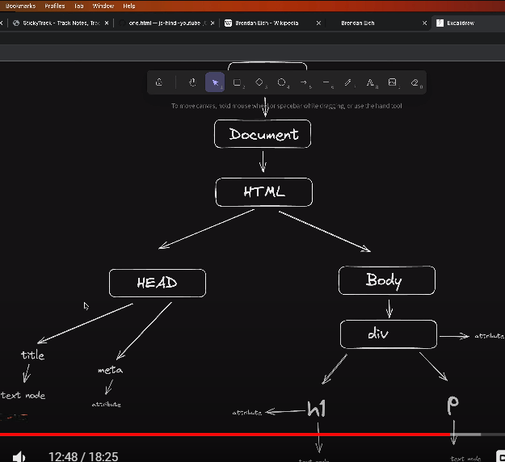

# DOM - Document Object Model

* The Document Object Model (DOM) is a representation of an HTML document as a tree of objects. 
* It is a hierarchical representation of the structure of a web page 
* Its use is to target and manipulate HTML elements according to our needs.


## DOM Objects
* Each element in an HTML document is represented as a node in the DOM, and that each node can be considered an object in the context of the DOM to apply methods specific to DOM objects.
* Nodes can have child nodes, which are other nodes that are nested within them. 
* For example, the 'body' tag in an HTML document would be considered an object in the DOM, and it would be a node in the tree of objects. 
* The 'p' tags within the 'body' tag would be considered child nodes of the <body> node.




## Accessing DOM Objects
### To access DOM objects in JavaScript, you can use the following methods:

* 1. document.getElementById('id'): Gets the element with the specified ID.
* 2. document.getElementsByTagName('tag-name'): Gets all the elements with the specified tag name.
* 3. document.getElementsByClassName('class-name'): Gets all the elements with the specified class name.


## Example:

### In the following example, we access the 'h2' element with the ID "firstHeading" and change its innerHTML to "Chai aur Code":

```js
console.log(document.getElementById('firstHeading')); 
// Targets the <h1> element

document.getElementById('firstHeading').innerHTML = '<h1>Chai aur Code</h1>'; 
// Change its innerHTML
```

# Note:
* In a browser environment, the window object represents the global environment and provides access to the DOM. 
* You can use window.document to access the document object.
