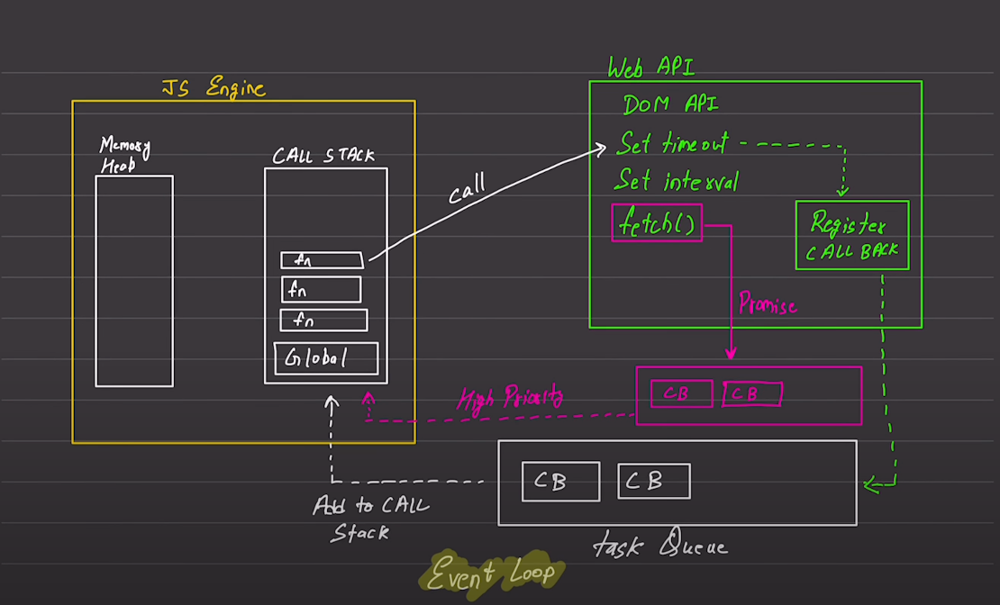

# Async Code

## General Knowledge

* Javascript is a synchronous (line by line code Execution)

* Javascript is single threaded ( It is slow but not let you feel it as it not only use javascript engine alone, everywhere it comes with a run-time Environment like Browser )

* Each Operations waits for the last one to complete before executing any further.

# Type of code in Javascript: 

## Blocking code:
* Blocks the flow of execution of the program.
* In an operating system, (Read a file and bring data) a program cannot read a file.
* To read a file, it has to give context to the kernel. The kernel accesses it and then gives execution to the program and lets it know the success.
* Until the kernel signals or gives any response, the program cannot execute any other operations.
* It reads the file synchronously.

## Non Blocking code:
* Does not block execution flow of the program.
* In this code, it reads a file asynchronously.
* This means that other functionality of the code can be performed until the kernel notifies you.

# Event Loop

## Theory:
* 1. JS Engine: => Memory Heap and => Call Stack  
    * Never is a engine is given alone, it always comes with a run-time Environment ( as Javascript is single threaded and using only JS Engine - it will become quiet slow and not very efficient )

* 2. Web API ( Available only in Browser)
    * Asynchronous API:
        1. Set timeout
        2. Set interval

    * New API in Javascript:
        * **Fetch() API**:
            * It has the same function as Task Queue but adds an additional Task Queue with HIGHER PRIORITY.
            * It utilizes the concept of Promises.
            * Provides fast execution.

* 3. Register CALL BACK
    * The Register Callback is responsible for adding tasks to the callback queue.

* 4. Task Queue 
    * The Task Queue is responsible for managing the order in which tasks are executed. It follows the FIFO (First In First Out) principle, meaning that tasks are executed in the order they are added to the queue.
    * It follows the principle of FIFO => First In First Out

## Process:
 * Imagine you have a function that calls the setTimeout() method (an asynchronous API). When this happens, the function looks for setTimeout (or any other event) in a "Web API" area.

*  Web APIs stores the task to Register Call Back. "setTimeout()" and other events are handled by a "Register Callback." This callback remembers the tasks that need to be done, as they are not executed immediately because they are asynchronous.

* Multiple tasks can be stored in the Register Callback. The register callback adds the event to the Task Queue whenever it is said to be used. This queue follows the "First In, First Out" (FIFO) principle. 

* Finally, the Task Queue adds the tasks to the "Call Stack." This stack follows the "Last In, First Out" (LIFO) principle, meaning that the last task added to the stack will be the first one executed.

### Trick Question: 
* A program to print after a set time:
    * print 1 => after a set timeout of 0, print 2 => print 3
    * How it will print??
    * It will not print like ike Output: 1, 2, 3 because the set timeout will go as:
    * To Web API as a call => to Register CALL BACK => to Task Queue => then, finally to CALL STACK
    * Even if it is immediate
    * Until then print 3 will execute ( Output: 1, 3, 2)

# Additionals
* In Browser, Javascript does not have enough privileges to read a file.
* Node.js gives File System Access
* Both codes have different Use-Cases. Example:
    * In a Database, until the write operation is completed, a success message will be shown, which is not correct, as there may be a possibility of some error. So using Blocking code is better than using Non Blocking code.

